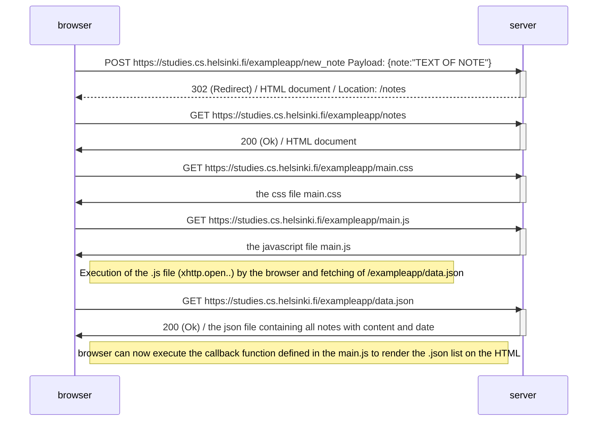

# Sequence diagram of a new note

```mermaid
    sequenceDiagram
        participant browser
        participant server

        browser->>server: POST https://studies.cs.helsinki.fi/exampleapp/new_note Payload: {note:"TEXT OF NOTE"}
        activate server
        server-->>browser: 302 (Redirect) / HTML document / Location: /notes
        deactivate server

        browser->>server: GET https://studies.cs.helsinki.fi/exampleapp/notes
        activate server
        server->>browser: 200 (Ok) / HTML document
        deactivate server

        browser->>server: GET https://studies.cs.helsinki.fi/exampleapp/main.css
        activate server
        server->>browser: the css file main.css
        deactivate server

        browser->>server: GET https://studies.cs.helsinki.fi/exampleapp/main.js
        activate server
        server->>browser: the javascript file main.js
        deactivate server

        Note right of browser: Execution of the .js file (xhttp.open..) by the browser and fetching of /exampleapp/data.json

        browser->>server: GET https://studies.cs.helsinki.fi/exampleapp/data.json
        activate server
        server->>browser: 200 (Ok) / the json file containing all notes with content and date
        deactivate server

        Note right of browser: browser can now execute the callback function defined in the main.js to render the .json list on the HTML 
```
