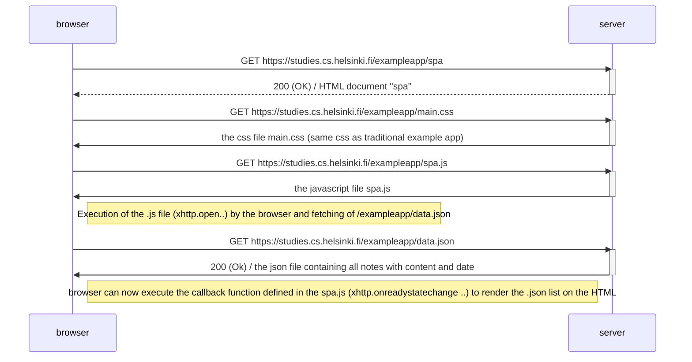

# Sequence diagram of a single page app
User simply load a the spa page by making a GET request to https://studies.cs.helsinki.fi/exampleapp/spa.

```mermaid
    sequenceDiagram
        participant browser
        participant server

        browser->>server: GET https://studies.cs.helsinki.fi/exampleapp/spa
        activate server
        server-->>browser: 200 (OK) / HTML document "spa"
        deactivate server

        browser->>server: GET https://studies.cs.helsinki.fi/exampleapp/main.css
        activate server
        server->>browser: the css file main.css (same css as traditional example app)
        deactivate server

        browser->>server: GET https://studies.cs.helsinki.fi/exampleapp/spa.js
        activate server
        server->>browser: the javascript file spa.js
        deactivate server

        Note right of browser: Execution of the .js file (xhttp.open..) by the browser and fetching of /exampleapp/data.json

        browser->>server: GET https://studies.cs.helsinki.fi/exampleapp/data.json
        activate server
        server->>browser: 200 (Ok) / the json file containing all notes with content and date
        deactivate server

        Note right of browser: browser can now execute the callback function defined in the spa.js (xhttp.onreadystatechange ..) to render the .json list on the HTML 
```
