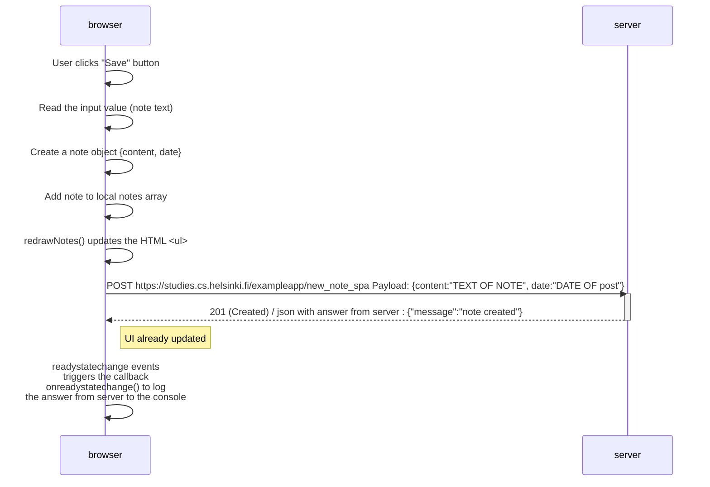

# Sequence diagram of a new note on single page app
User adds a note on the spa page by making a GET request to https://studies.cs.helsinki.fi/exampleapp/spa.

```mermaid
    sequenceDiagram
        participant browser
        participant server

        
        browser->>browser: User clicks "Save" button
        browser->>browser: Read the input value (note text)
        browser->>browser: Create a note object {content, date}
        browser->>browser: Add note to local notes array
        browser->>browser: redrawNotes() updates the HTML <ul>
     

        browser->>server: POST https://studies.cs.helsinki.fi/exampleapp/new_note_spa Payload: {content:"TEXT OF NOTE", date:"DATE OF post"}
        activate server
        server-->>browser: 201 (Created) / json with answer from server : {"message":"note created"}
        deactivate server
        Note right of browser: UI already updated

        browser->>browser: readystatechange events<br/> triggers the callback<br/> onreadystatechange() to log<br/> the answer from server to the console
```